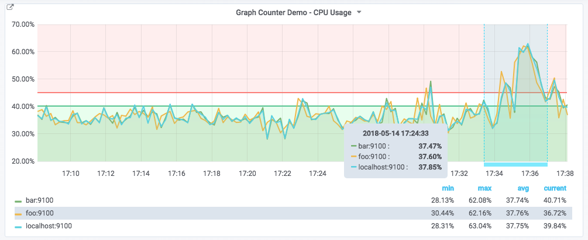
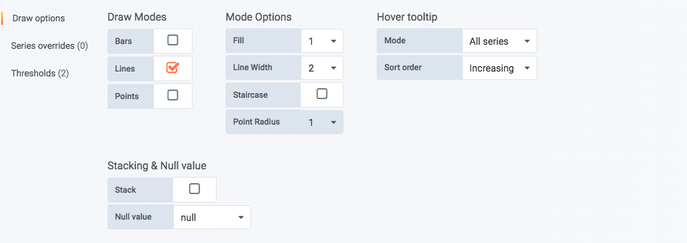
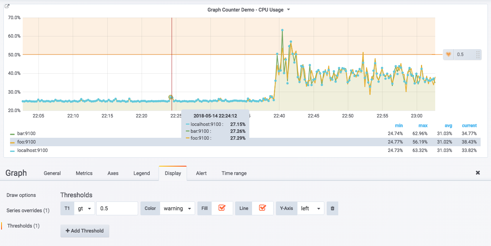
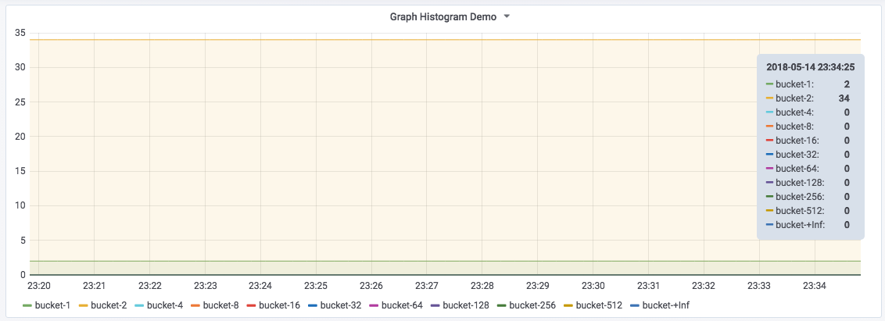

# 变化趋势：Graph面板

Graph面板是最常用的一种可视化面板，其通过折线图或者柱状图的形式显示监控样本随时间而变化的趋势。Graph面板天生适用于Prometheus中Gauge和Counter类型监控指标的监控数据可视化。例如，当需要查看主机CPU、内存使用率的随时间变化的情况时，可以使用Graph面板。同时，Graph还可以非常方便的支持多个数据之间的对比。


## Graph面板与Prometheus

Graph面板通过折线图或者柱状图的形式，能够展示监控样本数据在一段时间内的变化趋势，因此其天生适合Prometheus中的Counter和Gauge类型的监控指标的可视化，对于Histogram类型的指标也可以支持，不过可视化效果不如Heatmap Panel来的直观。

### 使用Graph面板可视化Counter/Gauge

以主机为例，CPU使用率的变化趋势天然适用于使用Grapn面板来进行展示：



在**Metrics选项**中，我们使用以下PromQL定义如何从Prometheus中读取数据：

```text
1 - (avg(irate(node_cpu{mode='idle'}[5m])) without (cpu))
```

如下所示：


根据当前Prometheus的数据采集情况，该PromQL会返回多条时间序列（在示例中会返回3条）。Graph面板会从时间序列中获取样本数据，并绘制到图表中。 为了让折线图有更好的可读性，我们可以通过定义**Legend format**为`{{ instance }}`控制每条线的图例名称：


由于当前使用的PromQL的数据范围为0~1表示CPU的使用率，为了能够更有效的表达出度量单位的概念，我们需要对Graph图表的坐标轴显示进行优化。如下所示，在**Axes选项**中可以控制图标的X轴和Y轴相关的行为：


默认情况下，Y轴会直接显示当前样本的值，通过**Left Y**的**Unit**可以让Graph面板自动格式化样本值。当前表达式返回的当前主机CPU使用率的小数表示，因此，这里选择单位为**percent\(0.0.-1.0\)**。除了百分比以外，Graph面板支持如日期、货币、重量、面积等各种类型单位的自动换算，用户根据自己当前样本的值含义选择即可。

除了在Metrics设置图例的显示名称以外，在Graph面板的**Legend选项**可以进一步控制图例的显示方式，如下所示：


**Options中**可以设置图例的显示方式以及展示位置，**Values**中可以设置是否显示当前时间序列的最小值，平均值等。 **Decimals**用于配置这些值显示时保留的小数位，如下所示：


除了以上设置以外，我们可能还需要对图表进行一些更高级的定制化，以便能够更直观的从可视化图表中获取信息。在Graph面板中**Display选项**可以帮助我们实现更多的可视化定制的能力，其中包含三个部分：Draw options、Series overrides和Thresholds。



**Draw Options**用于设置当前图标的展示形式、样式以及交互提示行为。其中，Draw Modes用于控制图形展示形式：Bar（柱状）、Lines（线条）、Points（点），用户可以根据自己的需求同时启用多种模式。Mode Options则设置各个展示模式下的相关样式。Hover tooltip用于控制当鼠标移动到图形时，显示提示框中的内容。

如果希望当前图表中的时间序列以不同的形式展示，则可以通过**Series overrides**控制，顾名思义，可以为指定的时间序列指定自定义的Draw Options配置，从而让其以不同的样式展示。例如：


这里定义了一条自定义规则，其匹配图例名称满足**/localhost/**的时间序列，并定义其以点的形式显示在图表中，修改后的图标显示效果如下：


Display选项中的最后一个是**Thresholds**，Threshold主要用于一些自定义一些样本的阈值，例如，定义一个Threshold规则，如果CPU超过50%的区域显示为warning状态，可以添加如下配置：



Graph面板则会在图表中显示一条阈值，并且将所有高于该阈值的区域显示为warining状态，通过可视化的方式直观的在图表中显示一些可能出现异常的区域。

需要注意的是，如果用户为该图表自定义了Alert（告警）配置，Thresholds将会被警用，并且根据Alert中定义的Threshold在图形中显示阈值内容。关于Alert的使用会在后续部分，详细介绍。

### 使用Graph面板可视化Histogram

以Prometheus自身的监控指标prometheus\_tsdb\_compaction\_duration为例，该监控指标记录了Prometheus进行数据压缩任务的运行耗时的分布统计情况。如下所示，是Prometheus返回的样本数据：

```text
# HELP prometheus_tsdb_compaction_duration Duration of compaction runs.
# TYPE prometheus_tsdb_compaction_duration histogram
prometheus_tsdb_compaction_duration_bucket{le="1"} 2
prometheus_tsdb_compaction_duration_bucket{le="2"} 36
prometheus_tsdb_compaction_duration_bucket{le="4"} 36
prometheus_tsdb_compaction_duration_bucket{le="8"} 36
prometheus_tsdb_compaction_duration_bucket{le="16"} 36
prometheus_tsdb_compaction_duration_bucket{le="32"} 36
prometheus_tsdb_compaction_duration_bucket{le="64"} 36
prometheus_tsdb_compaction_duration_bucket{le="128"} 36
prometheus_tsdb_compaction_duration_bucket{le="256"} 36
prometheus_tsdb_compaction_duration_bucket{le="512"} 36
prometheus_tsdb_compaction_duration_bucket{le="+Inf"} 36
prometheus_tsdb_compaction_duration_sum 51.31017077500001
prometheus_tsdb_compaction_duration_count 36
```

在第2章的“Metric类型”小节中，我们已经介绍过Histogram的指标，Histogram用于统计样本数据的分布情况，其中标签le定义了分布桶Bucket的边界，如上所示，表示当前Prometheus共进行了36次数据压缩，总耗时为51.31017077500001ms。其中任务耗时在0~1ms区间内的为2次、在0~2ms区间范围内为36次，以此类推。

如下所示，如果需要在Graph中显示Histogram类型的监控指标，需要在Query Editor中定义查询结果的**Format as**为Heatmap。通过该设置Grafana会自动计算Histogram中的Bucket边界范围以及该范围内的值：


Graph面板重新计算了Bucket边界，如下所示，在0~1ms范围内的任务次数为2，在1~2ms范围内的运行任务次数为34。通过图形的面积，可以反映出各个Bucket下的大致数据分布情况：



不过通过Graph面板展示Histogram也并不太直观，其并不能直接反映出Bucket的大小以及分布情况，因此在Grafana V5版本以后更推荐使用Heatmap面板的方式展示Histogram样本数据。关于Heatmap面板的使用将会在接下来的部分介绍。

