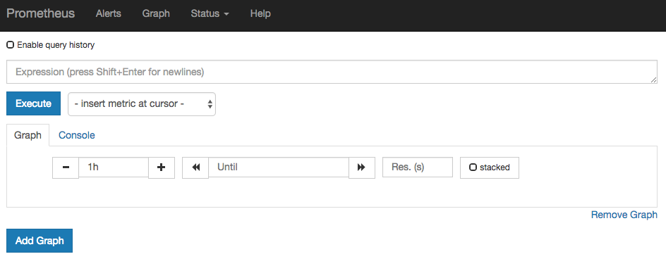
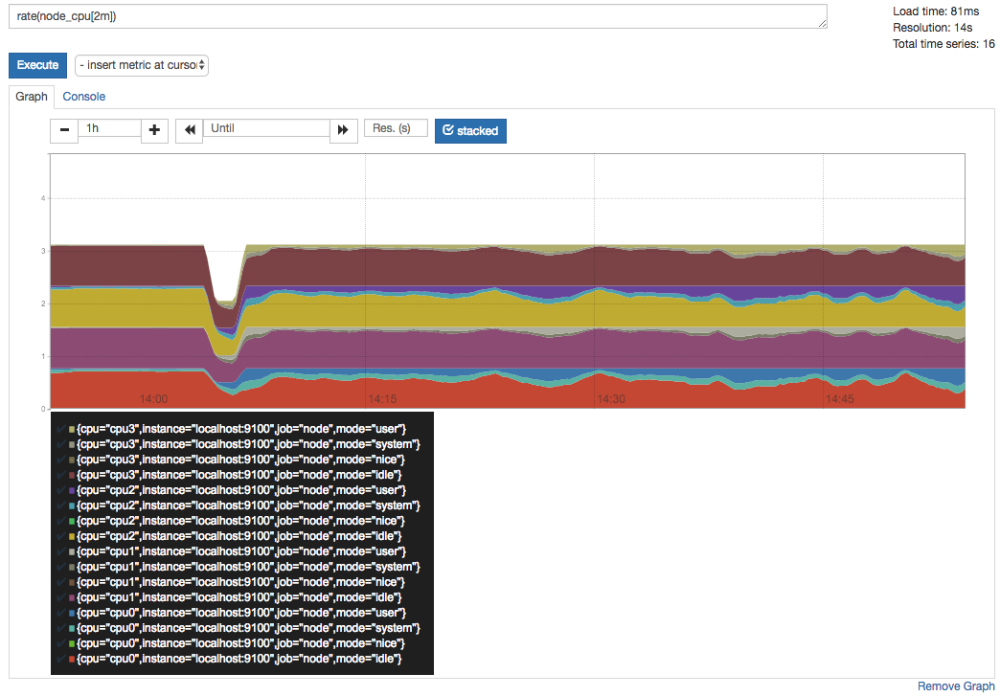

# 使用PromQL查询监控数据

Prometheus UI是Prometheus内置的一个可视化管理界面，通过Prometheus UI用户能够轻松的了解Prometheus当前的配置，监控任务运行状态等。 通过`Graph`面板，用户还能直接使用`PromQL`实时查询监控数据：



切换到`Graph`面板，用户可以使用PromQL表达式查询特定监控指标的监控数据。如下所示，查询主机负载变化情况，可以使用关键字`node_load1`可以查询出Prometheus采集到的主机负载的样本数据，这些样本数据按照时间先后顺序展示，形成了主机负载随时间变化的趋势图表：


PromQL是Prometheus自定义的一套强大的数据查询语言，除了使用监控指标作为查询关键字以为，还内置了大量的函数，帮助用户进一步对时序数据进行处理。例如使用`rate()`函数，可以计算在单位时间内样本数据的变化情况即增长率，因此通过该函数我们可以近似的通过CPU使用时间计算CPU的利用率：

```text
rate(node_cpu[2m])
```



这时如果要忽略是哪一个CPU的，只需要使用without表达式，将标签CPU去除后聚合数据即可：

```text
avg without(cpu) (rate(node_cpu[2m]))
```


那如果需要计算系统CPU的总体使用率，通过排除系统闲置的CPU使用率即可获得:

```text
1 - avg without(cpu) (rate(node_cpu{mode="idle"}[2m]))
```


通过PromQL我们可以非常方便的对数据进行查询，过滤，以及聚合，计算等操作。通过这些丰富的表达书语句，监控指标不再是一个单独存在的个体，而是一个个能够表达出正式业务含义的语言。

